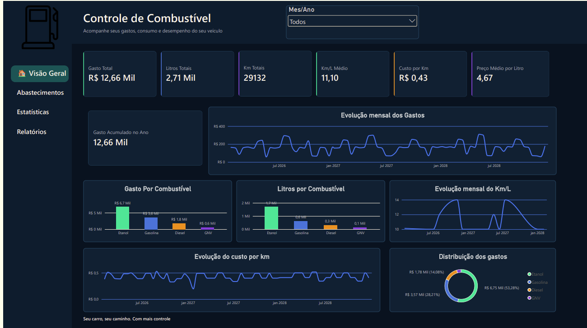
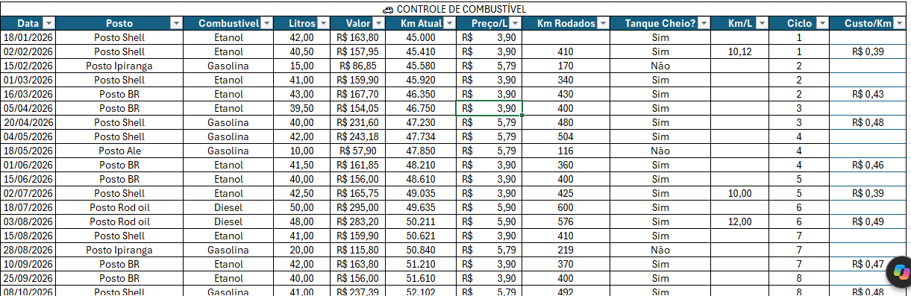
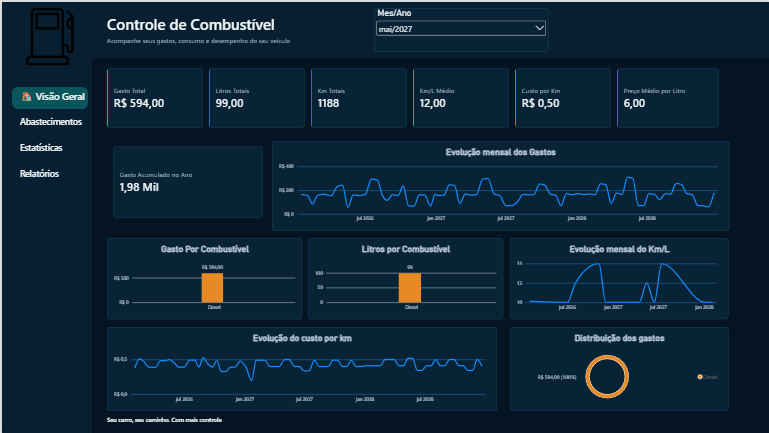

# 🚗 Controle e Análise de Consumo Veicular

Projeto de análise de dados desenvolvido com **Excel, Power Query, Power BI e DAX**, com o objetivo de transformar registros de abastecimento em indicadores de consumo, custos e eficiência veicular.

## 🎯 Objetivo

O objetivo do projeto foi transformar uma base de abastecimentos em uma solução de análise capaz de acompanhar os principais indicadores relacionados ao consumo e aos custos do veículo.

Entre as principais perguntas analisadas estão:

- Quanto foi gasto com combustível?
- Quantos litros foram abastecidos?
- Quantos quilômetros foram percorridos?
- Qual foi o consumo médio em Km/L?
- Qual foi o custo por quilômetro?
- Como os gastos evoluíram ao longo dos meses?
- Qual combustível representou a maior parcela dos gastos?
- Qual foi o gasto acumulado ao longo do ano?

## 📊 Dashboard



## 🛠️ Ferramentas utilizadas

| Ferramenta | Utilização |
|---|---|
| Excel | Estruturação da base e cálculos iniciais |
| Power Query | Limpeza e preparação dos dados |
| Power BI | Modelagem e criação do dashboard |
| DAX | Criação das medidas e indicadores |
| Inteligência Artificial | Geração dos dados sintéticos utilizados no projeto |

## 🔄 Processo do projeto

O desenvolvimento foi realizado seguindo as seguintes etapas:

**Dados sintéticos → Excel → Power Query → Power BI → DAX → Dashboard**

### 1. Excel

Estruturação da base de abastecimentos e desenvolvimento dos cálculos iniciais.



### 2. Power Query

Limpeza, organização e preparação dos dados para análise.

### 3. Power BI

Criação do modelo de dados e estruturação das análises.

### 4. DAX

Criação das medidas utilizadas nos indicadores e análises temporais.

### 5. Dashboard
Construção de uma interface interativa para acompanhamento dos principais indicadores.

## 📈 Principais indicadores

O dashboard apresenta indicadores relacionados a:

- 💰 Gasto total
- ⛽ Litros totais
- 🚗 Quilômetros totais
- 📊 Km/L médio
- 💵 Custo por quilômetro
- 🛢️ Preço médio por litro
- 📅 Gasto acumulado no ano

## 📁 Estrutura do projeto

```text
projeto-controle-consumo-veicular/
│
├── 01_Excel/
│   └── Controle_Consumo_Veicular.xlsx
│
├── 02_PowerBI/
│   └── Controle_Consumo_Veicular.pbix
│
├── 03_Documentacao/
│   └── Documentacao_Projeto.pdf
│
├── 04_Imagens/
│   ├── base-excel.png
│   ├── dashboard-completo.png
│   └── dashboard-filtro-mes.png
│
└── README.md
```

### 📂 Arquivos

- [Planilha Excel](01_Excel/Controle_Consumo_Veicular.xlsx)
- [Arquivo Power BI](02_PowerBI/Controle_Consumo_Veicular.pbix)
- [Documentação completa](03_Documentacao/Documentacao_Projeto.pdf)


- ## 🧠 Regra de negócio — combustível cruzado

Durante o desenvolvimento foi identificada uma situação que poderia comprometer a interpretação do indicador de Km/L: a ocorrência de combustíveis diferentes dentro de um mesmo ciclo de consumo.

Para evitar atribuir incorretamente o consumo a um único combustível, esses casos foram tratados separadamente e não utilizados no cálculo de Km/L quando não havia consistência suficiente para determinar o consumo de um combustível específico.

Essa regra foi incorporada à lógica utilizada no projeto.

## 🔎 Análise por período

O dashboard permite selecionar um período específico para analisar os indicadores de consumo e custos.



## ⚠️ Sobre os dados

Os dados utilizados neste projeto são **sintéticos** e foram gerados com auxílio de Inteligência Artificial para fins de estudo e desenvolvimento.

Eles não representam abastecimentos pessoais reais.

A IA foi utilizada para geração dos dados. A estruturação da base, definição das regras de negócio, tratamento, cálculos, modelagem e construção do dashboard foram desenvolvidos durante o projeto.
